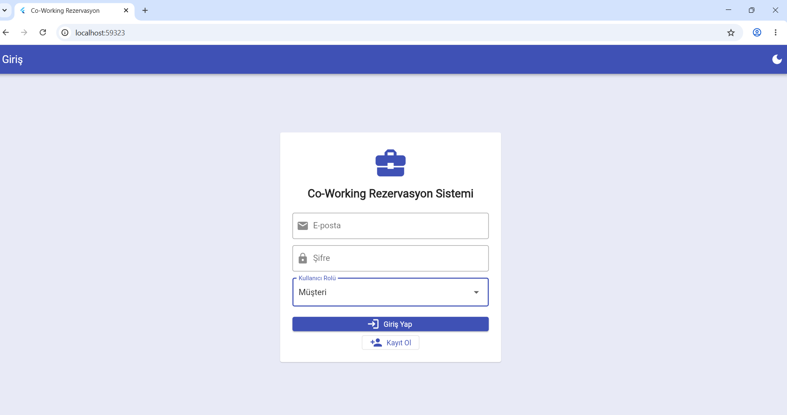
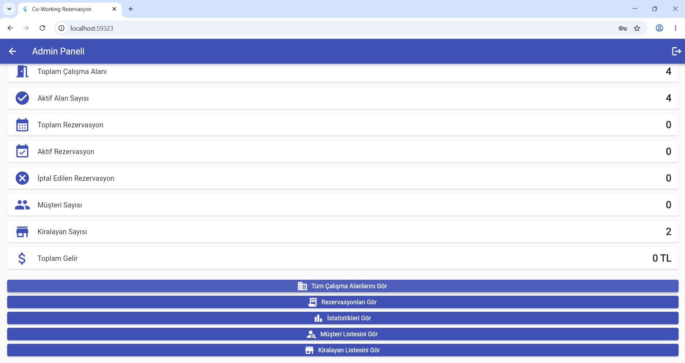
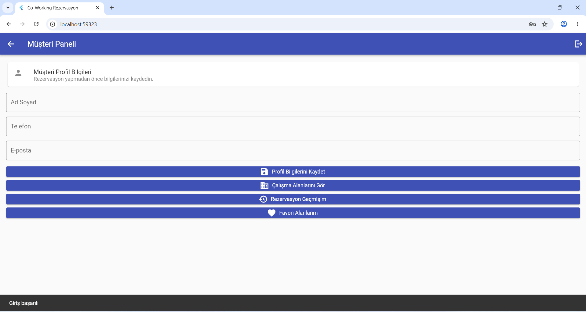
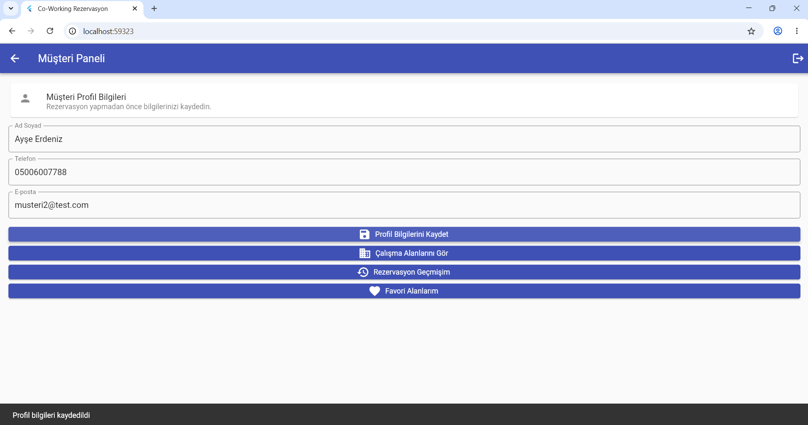
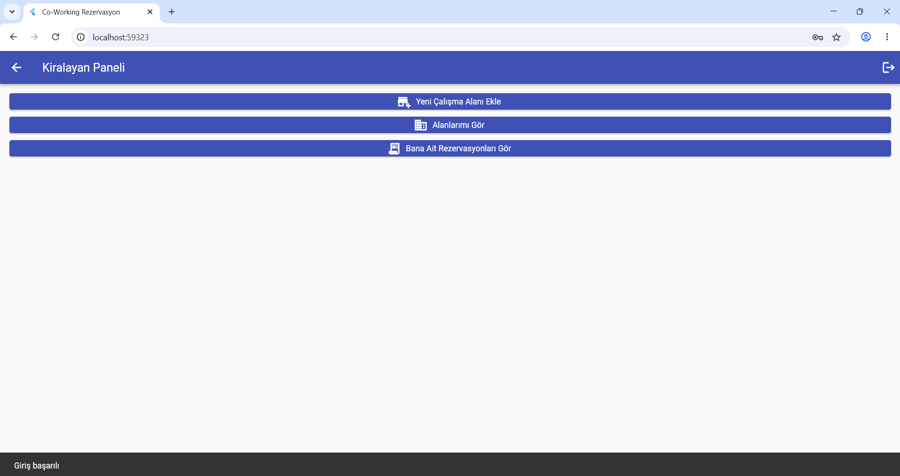
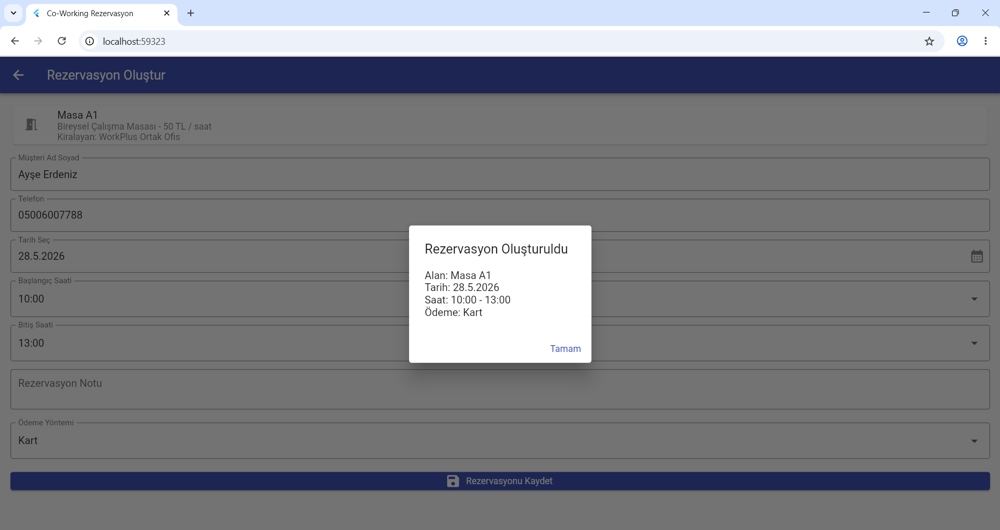
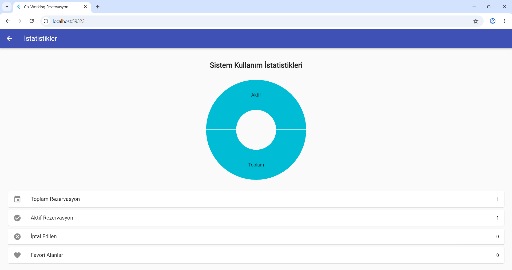
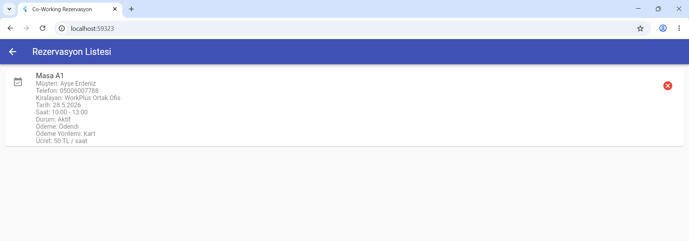

# Co-Working Rezervasyon Sistemi

## Öğrenci Bilgileri

Ad Soyad: Hatice Betül Dirican 
Öğrenci No: 243301013  

## Uygulama Açıklaması

Bu proje Flutter ile geliştirilmiş Co-Working yani ortak ofis rezervasyon ve yönetim sistemidir.  
Uygulamada müşteri, admin ve kiralayan olmak üzere farklı kullanıcı rolleri bulunmaktadır.

## Kullanıcı Rolleri

### Admin
- Sistemdeki genel istatistikleri görür.
- Rezervasyonları takip eder.
- Çalışma alanlarını görüntüler.
- Kullanıcı ve kiralayan bilgilerini inceleyebilir.

### Müşteri
- Profil bilgilerini kaydeder.
- Çalışma alanlarını listeler.
- Alan detaylarını görüntüler.
- Rezervasyon oluşturur.
- Favori alan ekler.
- Rezervasyon geçmişini görüntüler.

### Kiralayan / İşletme
- Yeni çalışma alanı ekler.
- Kendi alanlarını görüntüler.
- Rezervasyonları takip eder.

## Kullanılan Teknolojiler

- Flutter
- Dart
- Supabase Auth
- Supabase Database
- fl_chart

## Kullanılan Paketler

- supabase_flutter
- fl_chart

## Test Hesapları

### Admin
E-posta: admin@test.com  
Şifre: 123456  

### Müşteri
E-posta: musteri2@test.com  
Şifre: 123456  

### Kiralayan
E-posta: kiralayan@test.com  
Şifre: 123456  

## Uygulama Özellikleri

- Supabase ile kayıt ve giriş sistemi
- Rol bazlı yönlendirme
- Oturum devamlılığı
- Çıkış yapma
- Çalışma alanı ekleme
- Çalışma alanı düzenleme
- Çalışma alanı silme
- Rezervasyon oluşturma
- Rezervasyon çakışma kontrolü
- Rezervasyon notu ekleme
- Ödeme yöntemi seçimi
- Favori alanlar
- Admin istatistik ekranı
- Aktivite log kayıtları

## Veritabanı Tabloları

- users
- workspaces
- reservations
- favorites
- logs

## Ekran Görüntüleri

### Giriş Ekranı

### Admin Paneli

### Müşteri Paneli
 

### Müşteri Profili

### Kiralayan Paneli

### Rezervasyon Ekranı

### İstatistik Ekranı

### Rezervasyon Listesi

